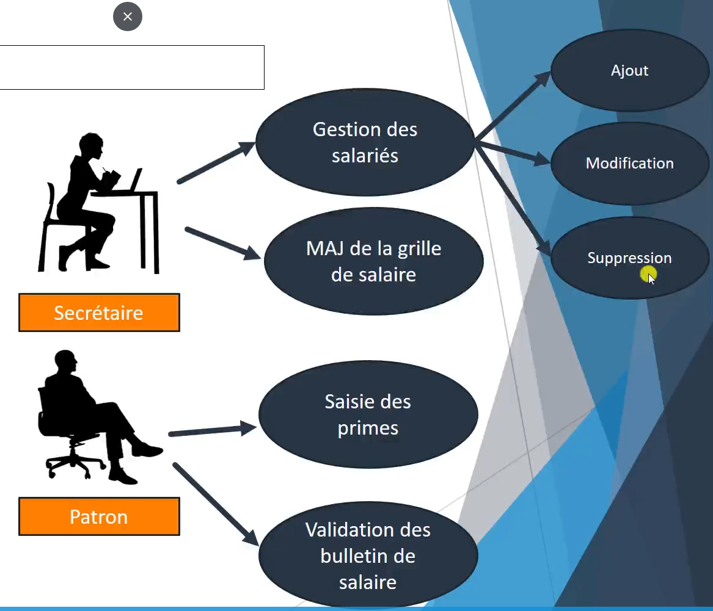
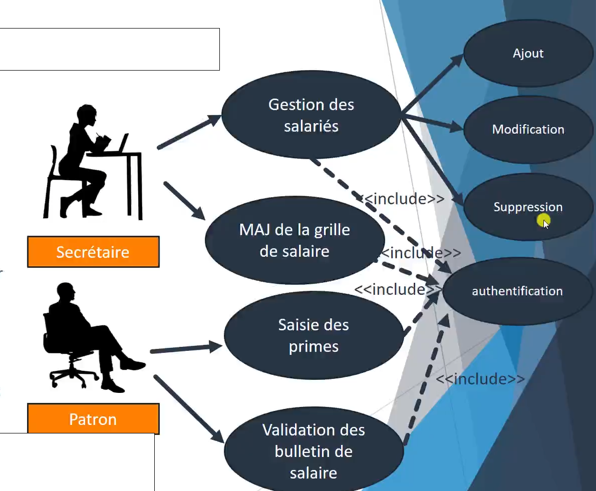

# 
CHAPITRE III : Le diagramme des cas d'utilisation (UC Use Case)

## 
PARTIE I : présentation de l'UC

Le diagramme suivant fait partie de la méthode UML et est celui que l'on réalise en premier en général, car il permet de poser les bases de la réflexion du projet.

Il souhaite répondre à deux questions de base :
- qui intervient ?
- pour faire quoi ?

Nous aurons alors deux parties importantes ici : les acteurs et les fonctionnalités de l'outil.

## 
Retour au cas concret 

La première étape est de nommer les acteurs.

Nous avons la chance incroyable d'avoir la liste des acteurs avec les informations que nous avons récoltées précédemment.

Ensuite, nous allons souhaiter savoir ce qu'ils vont faire sur notre outil.

Le diagramme est simple : les acteurs sont représenté par des visages, les taches sont dans des bulles. les flèches représentes les liens entre les acteurs et les fonctionnalités.

On peut également détailler un peu plus les fonctionnalités :

Nous devons également rajouter des droits pour définir des accès spécifiques aux acteurs, ``<<include>>`` indique qu'une foncionnalité est nécessaire pour en réaliser une autre. ici cela veut dire que toutes les actions sensibles nse seront accessible qu'après que l'acteur se soit identifié et nous utilisons des flèches en pointillé et le mot clef include pour le cristaliser :

Un autre exemple possible est sur les sites internet où nous pouvons voir du contenu, mais n'avoir accès qu'a des modifications administrateur qu'après s'être identifié.

### 
L'extension d'une fonctionnalité

Hors de notre cas, mais ici pour l'exemple : il est tout à fait possible grâce au mot clef ``<<extend>>``. Il permet d'indiquer qu'une fonctionnalité peut être appelée lors de la réalisation d'une autre.

Ici, lors de la mise à jour de salaire par la secrétaire, celle-ci peut lancer la vérification de l'écart des salaires. Cela n'a pas un caractère obligatoire et nous pouvons préciser le cas d'utilisation en rajoutant une note indiquant la condition pour laquelle cette fonctionnalité interviendra.

Dans cet exemple, on veut que la vérification des écarts de salaire soit lancée si le grade du salarié est B ou C, mais pas dans le cas du grade A (celui du patron).

Nous donnons alors donner un nom à cette extension ici "verif_ecart". En résumé cette fonctionnalité d'extend permet de dire que cette fonctionnalité "vérification des écarts de salaire" peut être appelé dès lors qu'on va réaliser la "MAJ de la grille de salaires"

## 
 PARTIE II : retour vers le patron / client

Avant d'aller plus loin, nous faisons valider le diagramme pour continuer ensuite l'analyse. 

Nous pensions avoir tout pris en compte quand le patron nous demande comment sont transmis les bulletins de paie aux salariés ?

Suite à un bref échange, nous nous mettons d'accord pour que les salariés puissent visualiser et récupérer leurs bulletins de salaire dans un espace réservé aux salariés. L'action de dépôt se réalise lors de la validation des fiches de paie de manière automatique.

Nous allons alors compléter notre diagramme de UC.

Imaginez la scène si vous n'aviez pas validé cette étape au client... l'angoisse.

voici le diagramme mis à jour :

- Nous rajoutons un nouvel acteur : les salariés.
    - ils n'interviennent pas dans le même système, car ils n'ont pas accès à l'outil directement.
- nous avons alors 2 systèmes différents :
    - le logiciel de paie
    - l'espace salarié
    - nous pouvons dans le diagramme des cas d'utilisation montrer la distinction du système en écrivant simplement le nom de celui-ci en haut du diagramme.
- vous pouvez remarquer la fonctionnalité "dépôt des fiches de paie dans l'espace salarié" et un lien d'inclusion avec la "validation des bulletins de salaire."
    - ici, c'est bien le dépôt qui nécessite au préalable la validation des bulletins de salaire de la part du patron, d'où l'orientation de la flèche.

Nous revalidons l'UC auprès du client en le lui expliquant, et gardons une trace écrite. 

Une fois le diagramme des cas d'utilisation effectué, il est possible de lui détailler un faisant une [description textuelle détaillé](https://www.wikiwand.com/fr/Cas_d%27utilisation) (DTD). Celle-ci permet d'expliquer précisément chacune des fonctionnalités. Nous ne la verrons pas en détail dans ce cours.
____

Fin du chapitre concernant le diagramme des cas d'utilisation. Merci d'avoir lu ce didacticiel. Prochain chapitre :

 **"le maquettage"**

