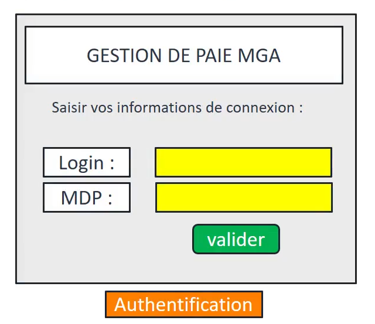
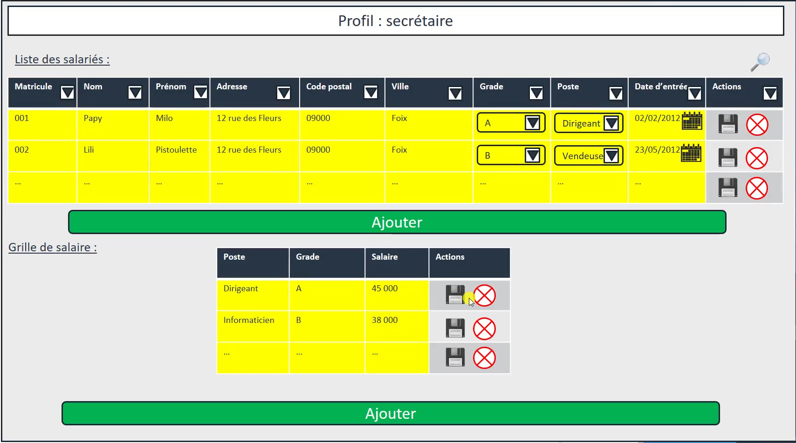
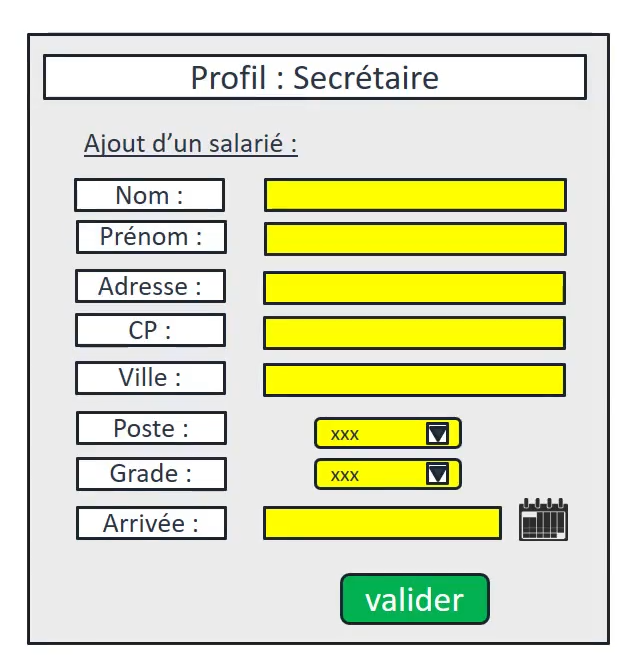
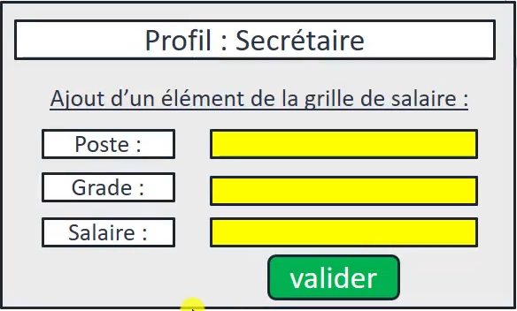
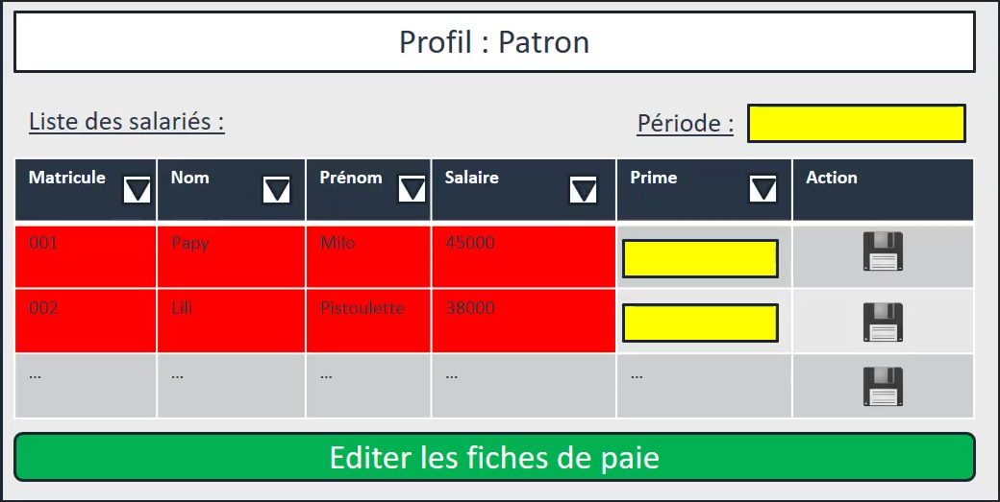
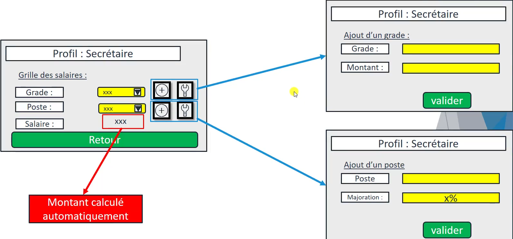
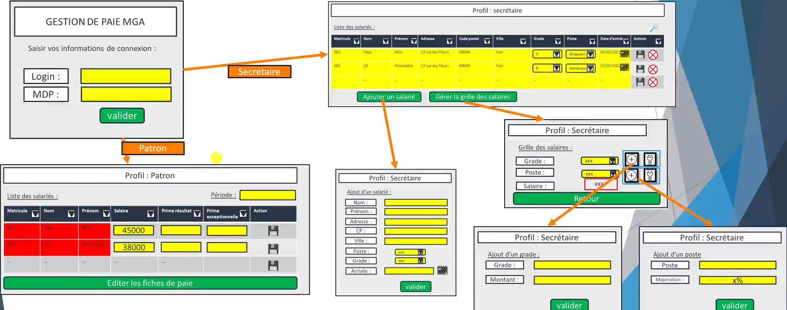

# 
CHAPITRE IV : maquettage / wireframe

## 
 PARTIE I :présentation des maquettes du projet

Nous allons proposer des maquettes sur chacune des fonctionnalités du futur outil. Nous ne validons pas l'aspect graphique mais le fonctionnement général de l'outil. plusieurs outils sont disponible sur internet comme [wireframe cc](https://wireframe.cc/) mais peuvent tout a fait être faite à la main.

regardons un début de maquette, ici une petite légende pour bien comprendre les éléments :

et maintenant la maquette du login pour gérer l'authentification :

et le wireframe du logiciel et des fonctionnalités :

Nous remarquons que la liste des salariés est présente et que les éléments sont modifiables. Regardons attentivement la disquette représentant la sauvegarde, les flèches déroulantes, le calendrier, les croix rouges... Il ne faut pas hésiter à construire sa maquette avec une symbologie claire et percutante.

Nous voulons éviter d'avoir une maquette hermétique et où les éléments sont difficiles à identifier. 

nous n'oublions pas après la construction de cette maquette de suivre la logique de notre outil et de créer les pages d'ajout d'un salarié et d'ajout d'un élément de la grille de salaire:

ajout d'un salarié :

ajout d'un élément de la grille de salaire : 

Ces deux maquettes permettront de saisir les données nécessaires de l'outil. Nous pouvons remarquer par exemple qu'ici les listes déroulantes pour le poste et le grade sont présente, ça suppose que les grades et les postes existent au préalable.

Regardons la maquette du patron :

Ici, on remarque l'absence d'éléments qui étaient présents dans la maquette précédente et de la possibilité de rajouter une prime. L'édition de fiche de paie est aussi singulière ici.  

Nous n'aurons plus qu'à valider ces maquettes auprès du client. Si c'est possible et que vous en ressentez le besoin, on peut proposer différentes sortes de maquette pour présenter les perspectives possibles.

La différence des outils est particulièrement visible à cette étape. En effet, la possibilité de créer différentes maquettes est aussi nombreuse que les subjectivités.

Une fois les maquettes validées, soyez assuré du gain de temps que vous avez fait par la simple initiative d'avoir réfléchi en amont et d'augmenter les probabilités la réussite du projet.

____

## 
PARTIE II : les modifications d'une maquette

Suite à la présentation des maquettes au client, des modifications vont devoir se faire :

- le patron veut pouvoir modifier les salaires.
- le calcul du salaire de base ne se fait pas comme nous l'avions prévu, car il dépend du grade et d'une majoration par poste.
- ce n'est pas en effet à la secrétaire de mettre directement le montant, il faut saisir un salaire de base par grade et le pourcentage de majoration par poste.
- le patron veut aussi pouvoir avoir la possibilité de rentrer des primes exceptionnelles.
- notez l'absence de cette notion dans le recueil du besoin, voilà la réalité... Restons positif, nous n'avons pas encore fait de ligne de code et le changement est acceptable.

les modifications concrètees : 
- la maquette du patron :
    - rajout de champs jaune pour saisir le salaire.
    - rajout de la prime exceptionnelle
- la secrétaire :
    - suppression de la partie inférieure sur la grille de salaires
    - ajout d'un bouton pour gérer la grille des salaires. (3 écrans supplémentaires, voir schéma en bas)
        - écran pour visualiser le salaire de base en fonction du grade et du poste calculé automatiquement et des bouttons pour les deux écrans suivant
        - un écran bout ajouter/modifier un grade
        - un écran pour ajouter/modifier un poste

la gestion de la grille des salaires de la secrétaire :

les changement généraux :    

Nous retournons alors pour faire valider nos maquettes au client, la trace écrite est encore conseillé. 

____

Fin du chapitre concernant le maquettage. Merci d'avoir lu ce didacticiel. Prochain chapitre :

 **"l'analyse des données"**

