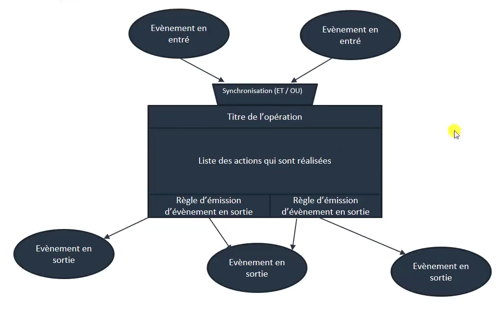
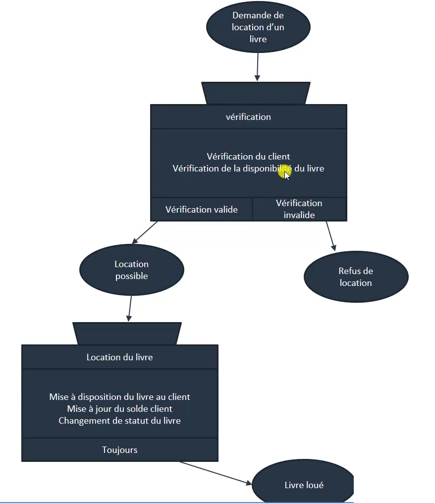
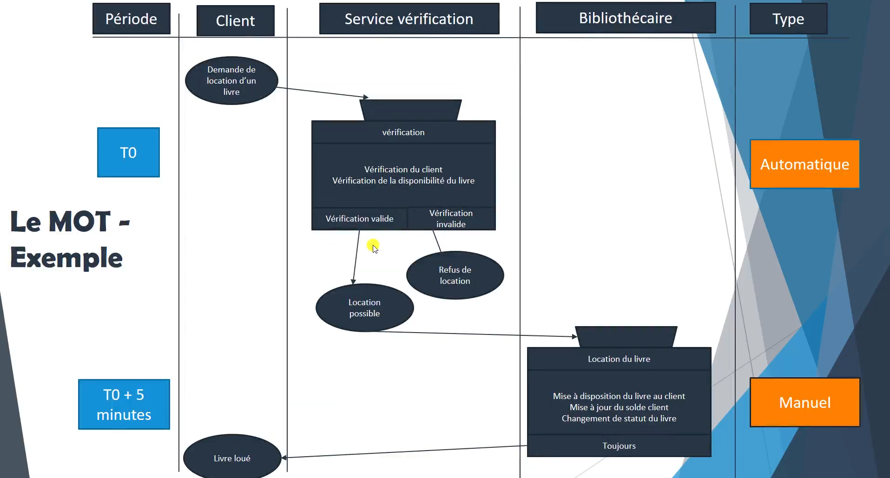

# 
 CHAPITRE VIII : l'analyse des traitements - le MCT (modèle conceptuel des traitements) et le MOT (Modèle organisationnel des Traitements)

Nous arrivons à la fin de ce petit didacticiel du kit de survie de l'analyse et de la conception pour les développeurs avec merise et UML.

Je vous rappel les trois parties dont traite MERISE :
1. Les flux
    - nous avons dans ce cours utilisé UML avec les use case. MERISE à sa propre méthodologie pour la gestion des flux, mais j'ai préféré ici montrer UML.
2. Les données
    - Nous avons choisi MERISE avec le MCD, le MLD et le MPD qui est selon moi indispensable.
3. Les traitements.
    - Toujours proposé par MERISE et que nous allons voir maintenant avec le MCT et le MOT.

Nous l'avançons ici tout de suite : la différence entre les deux est que le MCT propose la liste des différents traitements de l'outil et que la couche organisationnelle propose elle en plus les sacteurs et la notion de temporalité. 

Nous ne sommes pas obligé de faire ces étapes pour certain prrojet si l'équipe en décide ainsi. cependant il est toujours bon de savoir comment les faires et quand les utiliser. nous pouvons aussi avoir besoin de regarder d'autres orrganisation et d'autres outils comme des diagrammes UML tels que le [diagramme d'activité](https://www.wikiwand.com/fr/Diagramme_d%27activit%C3%A9), le [diagramme de séquence](https://www.wikiwand.com/fr/Diagramme_de_s%C3%A9quence) ou encore le [Diagramme états-transitions](https://www.wikiwand.com/fr/Diagramme_%C3%A9tats-transitions) que je ne présente pas ici.

## 
 PARTIE I : Introduction au modèle conceptuel des traitements

Voici la représentation d'un MCT qui va proposer des opérations :

Une opération c'est le cadre au centre qui comporte un titre et qui contient une liste d'action. 

- Pour lancer une opération nous allons avoir des événements en entrée qui interviendront sur l'outil et l'opération engendrera à la fin des événements de sortie.
- Dans le cas où plusieurs événements en entrée interviendraient sur l'opération, il faudra indiquer quelle sera la synchronisation, c'est-à-dire si les éléments doivent intervenir en même temps ou si l'opération se déclenche si seulement l'un des événements intervient.
    - ce sont donc ici les conditions dans lesquelles l'opération se lance.
- Pour les émissions d'événement de sortie, cela dépendra également des règles d'émission d'événement en sortie.

Reprenons l'exemple de nos livres pour avoir une vision plus concrète de ce schéma qui peut se montrer abstrait au début. 

Imaginons que nous souhaitons louer un livre dans notre bibliothèque, voici le schéma que je propose :

L'objectif est de traiter la location d'un livre et il y a deux opérations que l'on a identifiées :
1. L'opération de vérification du livre
2. L'opération de location

- Au démarrage l'élément déclencheur, c'est la demande de location d'un livre. Une fois cette action intervenante, nous avons :
    - l'opération de vérification qui se lance
- et deux actions sont réalisé :
    - la vérification du client
    - la vérification de la disponibilité du livre
- une fois les deux actions réalisées par l'outil il y a alors deux possibilités :
    - soit la location est possible et nous pourrons effectuer les opérations suivantes.
    - soit la vérification est invalide et il y aura un refus de location du livre.

Dans le cas d'une location possible d'un livre :
- cela déclenchera la location du livre qui contiendra trois actions :
    - la mise à disposition du livre au client
    - la mise à jour du solde client
    - le changement de statut du livre (de disponible à indisponible)
- une fois réalisé et dans tous les cas, le livre sera loué.

Voici le MCT complet permettant de gérer la location d'un livre.

Je tiens à préciser que c'est ici une façon graphique, visuelle et plus accessible pour poser un algorithme. En effet, ici, on pourrait générer du pseudo code ou dans un langage formel comme javascript, PHP, python... c'est cadeau.

## 
 PARTIE II : Introduction au modèle organisationnel de traitement

Le MOT permet de répondre aux question : qui? quand? Comment? et quoi?

Pour mettre en évidence ce model il suffit de rajouter des colones :
- 1 pour la période
- 1 par acteur
- 1 pour le type d'action
    - manuel ou automatique

regardons avec notre exemple de location d'un livre :

Nous retrouvons :
- notre colonne période
- les acteurs :
    - le client
    - le service de vérification
    - la bibliothécaire

Regardons ce qui se passe :
1. À la période T0 (au démarrage) : 
    - Le client demande la location d'un livre. 
    - le service de vérification intervient en faisant
        - la vérification client
        - la  vréfication de la disponibilité du livre
    - suivant les deux cas que nous avons 
        - une refus de location
        - soit une location possible :
2. en cas de possibilité de location du livre :
    - la bibliothécaire prend le relais et accomplit :
        - la mise à disposition du livre au client
        - la mise à jours du solde client
        - le changement de statut du livre
    - Elle donne le livre au client, il est loué.
    - cette opération interviendra environs 5 minutes après la première opération de vérification

la première opération sera automatique, la seconde sera manuel car la bibliothécaire fournira directement le livre.

___

Fin du chapitre concernant l'analyse des traitements. Merci d'avoir lu ce didacticiel. Il n'y a pas de prochain chapitre prévu.

 **"FIN DU DIDACTICIEL, BRAVO ! "**

