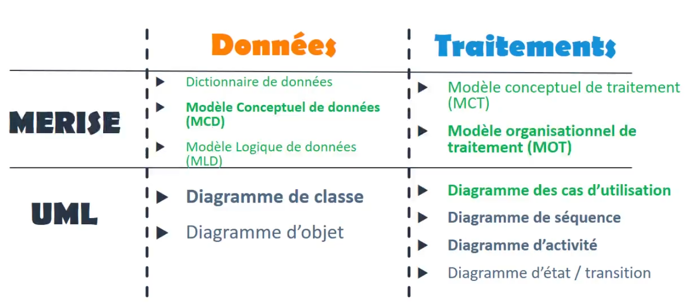

# CHAPITRE I : Introduction 

mots clefs : 
- recueil du besoin
- Diagramme des cas d'utilisation
- Maquettage
- Analyse des données théorie - MCD MLD & MPD
- Analyse des traitements - MCT & MOT

Ce petit projet qui rassemble les notions de base de l'analyse et de la conception informatique est vue pour être suivi dans l'ordre. En effet, il sera parfait dans l'accompagnement d'un nouveau projet, qu'un néophyte seul ou en groupe pourra alors utiliser et garder à côté de lui pendant la conception.

Le MCD rentre dans la partie de l'analyse, qui doit être en amont de la programmation. Faire une ligne de code avant cette étape, c'est augmenter les risques d'échec.

En tant que développeur, nous n'avons ni le temps ni le besoin de maîtriser les [théories des graphes](https://www.wikiwand.com/fr/Th%C3%A9orie_des_graphes). Mais négliger cette étape qu'est l'analyse et la conception révèle une incompréhension au métier de développeur.

D'autant plus que dans la pratique, il arrive souvent de faire un MCD, de programmer, de revenir sur le MCD et ce même avec une bonne expérience : le but ici n'est donc pas de ne plus le faire, mais de bien s'y préparer pour éviter le plus possible les allers retour de la réflexion et de l'opération.

____

## 
Partie I Introduction : l'esprit opérationel et le développement de projet .

____

La première question est de savoir où range t-on le(s) besoin(s) de l'entreprise :

1. Communiquer ? (site web)
2. Gérer ? (logiciel de paie, de gestion des achats...)
3. Organiser ? (logiciel de planification)
4. Vendre (site web, gestion des produits.)

Dans la chaîne de production, nous pouvons voir le cycle suivant :
- Analyser : comprendre les besoins du client, recueillir un temoignage et des documents interne et externe.
- Concevoir: identifier le nécessaire pour répondre aux besoins du client, le choix des technologies par exemple.
- Programmer: réaliser les lignes de code du logiciel.

Les deux parties retrouvables dans les programmes sont :
1. Les données : les informations vitales du programme
2. Les traitements : ils correspondent aux différentes actions réalisables sur le programme dont celles manipulant les données.

Toutes ces informations vont nous permettre de créer des diagrammes pertinents pour la réalisation du code. Coder sans y avoir réfléchi est une gageure et il est important d'avoir confiance au plan... Et donc de le concevoir...et donc d'avoir les moyens de le conçevoir.

### 
**comment créer un logiciel en somme ?**

1. Recueil du besoin
    - **description** : l'objectif est de récupérer la liste des exigences du client et de créer un cahier des charges
    - **comment** : interview + Compte rendu, récupération de documents du SI (système d'information)
2. Analyse du système
    - **description** : cette phase consiste à comprendre le besoin de votre client et a analyser son Système d'information. (SI)
    - **comment** : diagrammes et modélisations : MCD/cas d'utilisation...
3. **Conception** :
    - **description** : la conception consiste à définir l'ensemble des choix techniques de la solution proposée au client, permettant de répondre au cahier des charges.
    - **comment** : choix des technologies, des langages, des Framework, des solutions informatiques, des BDD...
4. **Programmation** :
    - **description** : une fois l'analyse et la conception réalisées, les équipes de programmation peuvent prendre le relais pour programmer la solution.
    - **comment** : écrire les lignes de codes.
5. **Test** :
    - **description** : l'objectif est de s'assurer que le programme réalisé est fonctionnel et correspond au besoin du client
    - **comment** : tests unitaires, test d'intégration, tests de validation, recette.
6. **Déploiement** :
    - **Description** : Mise en production de la solution et paramétrage de l'outil
    - **Comment** : Mise à disposition des utilisateurs.

Initialiser une de ses étapes avant l'autre augmente les risques de la non-réalisation du projet : choisir une technologie avant d'avoir analysé le système peut donc être fatal : imaginez si vous partez sur du noSQL alors que du SQL aurait été plus pertinent, ou alors avoir négligé le besoin de créer une application plus orienté mobile quand le client vous le précise : **vous ne savez pas quoi faire sans avoir effectué les 2 premières étapes sérieusement, acceptez le.**

Pour une analogie très simple, si le développeur se retrouve devant son éditeur de code et ne sait pas :
- comment agencer son planning ?
- ses priorités
- la répartition des tâches.
- Son choix technologique (souvent le piège est d'avoir réalisé l'étape 3 avant les deux autres, on se lance alors dans un parti pris technologique qui est dangereux).

... Alors toute tentative de code est au mieux une perte de temps, au pire un désastre, une défaite et une souffrance. On apprend de ses échecs n'est ce pas ? Mais un échec reste une souffrance et affaiblit. Arrêtez de croire que de vous cogner la tête contre les murs vous rendra plus fort : c'est stupide et le courage ne prédomine pas dans une victoire.

### 
**les cycles de vie possibles**

Les cycles de vie sont les approches organisationelle possible, en voici quelques une :

1. En [cascade](https://www.wikiwand.com/fr/Mod%C3%A8le_en_cascade) : les étapes s'enchaînent les unes après les autres.
    - souvent utilisé pour les projets perso et les petites équipes.
    - à le défaut que l'on peut se rendre compte très tard d'un problème et de perdre du temps
2. [Cycle en V](https://www.wikiwand.com/fr/Cycle_en_V) : les étapes se réalisent tout au long du développement du logiciel.
    - sorte d'amélioration du cycle en cascade.
    - réalisation des étapes une à une.
    - concoit en même temps les tests associés aux étapes.
3. [Modèle en spirale](https://www.wikiwand.com/fr/Mod%C3%A8le_en_spirale): l'objectif est d'avancer par version. (prototypage)
    - permet d'avancer par petits morceaux
    - souhaite un premier prototype avant d'avancer sur un second...
    - dans chaque étape de propotypage, on peut choisir le cycle en cascade ou le cycle en V.  
4. [Méthodes agiles](https://www.wikiwand.com/fr/M%C3%A9thode_agile) : elle se rapproche du cycle en spirale, mais proposant des versions spécifiques telles que XP, scrum...
    - reprend le modèle en cascade
    - propose une réactivité importante sur la réalisation de l'outil.$

Quand vous travaillez seul vous êtes le seul juge de ce que vous voulez faire, mais par pitié si vous travaillez en équipe, choisissez un cycle de vie et respectez le, sauf si vous préférez travailler dans le chaos.

### 
**PARTIE II : les méthodes d'analyse et de conception**

Voici 2 principales méthodes :
1. MERISE : méthode d'étude et de réalisation pour système d'entreprise. Méthode française très utilisée dans les SS2i aujourd'hui ESN. Cette approche est encore aujourd'hui très pertinente dans la conception des modèles de donnée. MERISE peut sembler moins intéressant au niveau des traitements, car cette méthode n'entre pas assez dans le détail et reste très macro en se focalisant sur les niveaux conceptuels et organisationel.
2. UML : Unified modeling langage. Très efficace pour par exemple la POO (programmation orientée objet.)

Nous utiliserons un diagramme UML : le diagramme des cas d'utilisation et plusieurs diagrammes de merise mais surtout le MCD.

Elles proposent de nombreux outils de représentation et de modélisation du besoin client. Souvent en pratique seulement certains de ces outils sont utilisés, nous devons les voir comme des boites à outil qui peuvent être utilisée ou non, en fonction des besoins du projet.

Ce sont deux incontournable et les maîtriser est nécessaire. On peut devenir un vrai puriste de ses méthodes, mais les faits montrent que ce n'est pas une nécessité, à vous de voir.

Voici les principaux modèles / diagrammes

les lignes en gras sont les principales, celles en verte seront celles que je vais détailler par la suite.

pour MERISE :
1. En données :
    - le dictionnaire de données : il permet de lister l'ensemble des informations nécessaires à l'application
    - le modèle conceptuel de données (MCD) : il permet de modéliser les entités, c'est-à-dire un regroupement d'information permettant d'identifier un objet ou un individu par exemple une maison avec plusieurs propriétés. Il permet également de montrer les relations entre les différentes entités.
    - le modèle logique de données (MLD) : il permet de se rapprocher de la BDD en proposant des tables et des relations entre elles.
2. En traitement :
    - le modèle conceptuel de traitement (MCT)
    - le modèle organisationnel de traitement (MOT)
        - Ces deux diagrammes sont intéressants au niveau de l'analyse macro du système d'information.

Pour UML :
1. En données :
    - [diagramme de classe](https://www.wikiwand.com/fr/Diagramme_de_classes)
    - [diagramme d'objet](https://www.wikiwand.com/fr/Diagramme_d%27objets)
        - très pratique pour la POO, mais s'éloigne de la BDD. Il peut être intéressant de compléter son MCD avec ces diagrammes si l'on fait donc de la POO.
2. En traitement :
    - [le diagramme des cas d'utilisation.](https://www.wikiwand.com/fr/Diagramme_de_cas_d%27utilisation#:~:text=Les%20diagrammes%20de%20cas%20d,d'utilisation%20sont%20plus%20appropri%C3%A9s.) Il permet de détailler l'ensemble des acteurs et des fonctionnalités de l'application. Il reprend simplement l'idée globale du MCT et du MOT et peut sembler plus facile à comprendre.
    - [diagramme de séquence](https://www.wikiwand.com/fr/Diagramme_de_s%C3%A9quence)
    - [diagramme d'activité](https://www.wikiwand.com/fr/Diagramme_d%27activit%C3%A9)
        - ces deux correspondent aux enchaînements des traitements
    - [diagramme d'état/transition](https://www.wikiwand.com/fr/Diagramme_%C3%A9tats-transitions)
        - permet de montrer les évolutions des états des objets du logiciel.

**pour aller plus loin** :
C'est l'un des aspects de la programmation ou les livres peuvent encore avoir un sens : voici 2 ouvrages pour les plus motivés et aller plus loin :

- [Merise guide pratique](https://www.amazon.fr/Merise-pratique-mod%C3%A9lisation-traitements-manipulations/dp/2409015344/ref=sr_1_1?__mk_fr_FR=%C3%85M%C3%85%C5%BD%C3%95%C3%91&crid=37QZG1W5YEV1F&keywords=Merise+Guide+Pratique+Jean-Luc+Baptiste&qid=1646821177&sprefix=merise+guide+pratique+%2Caps%2C78&sr=8-1)
- [UML pour les développeurs](https://www.amazon.fr/UML-pour-d%C3%A9veloppeurs-exercices-corrig%C3%A9s/dp/221212029X/ref=sr_1_1?__mk_fr_FR=%C3%85M%C3%85%C5%BD%C3%95%C3%91&crid=NLZPW72N8BWR&keywords=UML+pour+d%C3%A9veloppeur&qid=1646821209&sprefix=uml+pour+d%C3%A9veloppeur%2Caps%2C98&sr=8-1)

___

Fin de l'analyse et de la conception. Merci d'avoir lu ce didacticiel. Prochain chapitre :

 **"le recueil du besoin."**
