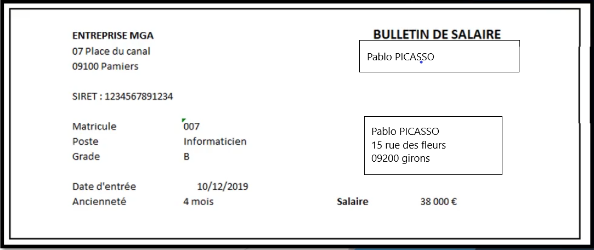

# 
CHAPITRE II : Le recueil du besoin : la nécessité de faire la clarté sur le sujet.

## 
PARTIE I : présentation d'un cas relativement concret :

Plongeons nous sans attendre dans un cas concret :

Vous êtes dans une petite boite et vous en êtes l'informaticien. Votre patron vous demande de faire un gestionnaire de paie pour les employées présent. En y regardant de plus près, vous avez des fichiers exels à votre disposition.

Notez que cet exemple est sur-implifié, et que la création d'une véritable fiche de paie serait bien plus complexe. Tenez donc en compte que c'est un exemple avec des données limitées pour en simplifier la démonstration.

Voici les différents tableaux, la fiche des salariés :

| Matricule | Employé          | Adresse |Grade  | Poste          | Date d'entrée |
| :--------------- |:---------------:| -----:|:--------------- |:---------------:| -----:|
| 001  |   Jean Mélenchon       | 12 rue des abricot 09000 Foie |A |   Dirigeant       | 02/02/2012 |
|007  | Pablo Picasso           |   15 rue des fleurs 09200 Girons |B  | Informaticien            |  10/12/2019 |
|003 | Hélène Detroie        |    02 place des Carmes 09100 Pamiers |B | Assistance         |    11/03/2019|
| 002  |   Elsa Jeans        |  12 rue des tomates 09000 Foie |B |   Vendeuse        | 23/05/2012 |
| 004  | Mamy Nova             |  13 rue des tulipes 09500 Crux |C  |Assistante          |   11/02/2018 |
| 006  | Handré Lepaté          |    18 place des rats 09800 Skaven |C  | Vendeur         |    15/05/2019 |
| 005 | Benjamin Franklin          |    03 rue des grenades 09300 Lousin |C  | Vendeur          |   13/03/2019 |

La grille de salaire : 
| Poste  | Niveau     | Montant de base|Prime|
| :--------------- |:---------------:| -----:|:---------------:|
|Dirigeant |  A    |  45k€ |30% des bénéfices |
| Informatitien  | B  |38k€ |0 |
| Assistante  | B et C   |    35k€ et 27k€ |0 |
| Vendeur |B et C    |   42k€ et 36k€ |20 % et 12 % des commission |

le but souhaité est de faire une feuille de paie qui ressemble à quelque chose comme ça :

Notez qu'ici des documents sont disponibles. Demander où créer des documents vous sera d'une grande aide.

Nous observons que le poste et le grade influe sur le salaire. Il existe aussi un système de prime qui est versé automatiquement. Le bulletin reprend les informations que nous avons et les dispose pour une lecture adaptée.

## la réflexion

Voici une liste de question qui peuvent être pertinente :
- Quel est l'outil le plus adapté pour répondre au besoin de mon patron?
    - un site
    - une application mobile?
    - une macro excel?
    - un logiciel?
- quelles seront les fonctionnalités de l'outil?
    - saisie des données?
        - qui?
    - importation de fichier excel?
    - simple clic sur un bouton pour générer les fiches de paie?

C'est à votre client de répondre à ces questions, nous avons un devoir de conseil et de guider vers la meilleure solution possible pour répondre a son besoin en lui exposant tous les tenants et aboutissants.

____

## 
PARTIE II : Un nouvel échange avec le patron

Lors de la pause du midi, car c'est le seul temps que votre patron a bien voulu vous consacrer, nous récoltons des informations précieuses :
- le patron va déléguer l'action de saisir les données dans l'outil à la secrétaire afin qu'elle puisse mettre à jours les informations.
- votre patron souhaite garder la main sur la vérification des saisies et la génération des fiches de paie.
- il veut également définir le montant des primes délivrées aux salariés, mais que ces informations ne soit pas visibles par la secrétaire.
- Il souhaite que l'outil ne soit accessible que sur les postes de la secrétaire et le sien.

Ce genre d'échange informel est tout à fait possible, une bonne pratique est de faire une vérification, une check-list des points que vous avez soulevé et de demander confirmation par mail pour avoir un suivi. Vous pourrez alors confirmer votre compréhension du sujet et de tracer les informations.

Il est important de faire valider par le client chaque étape et chaque nouvelle décision. Une trace écrite est importante et peut servir de preuve en cas de litige.

Les clients changent souvent d'avis, et encore quand ils savent ce qu'ils veulent : restez prudent. Vous aurez certainement besoin de rajouter plusieurs points au projet pendant son avancement. Ce n'est pas possible d'accepter toutes les modifications en cours de route et ça le client peut faire la sourde oreille. "Ce n'est pas ce qui était convenu" doit être la réponse que vous devez fournir. 

Ce n'est pas par ce que vous êtes le fournisseur que vous devez dire amen à toutes les envies du client. (pas gratuitement du moins). 

____

Fin du chapitre concernant le recueil du besoin. Merci d'avoir lu ce didacticiel. Prochain chapitre :

 **"le diagramme des cas d'utilisation"**

