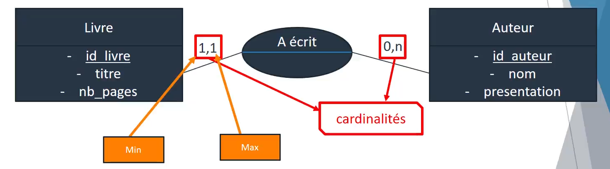
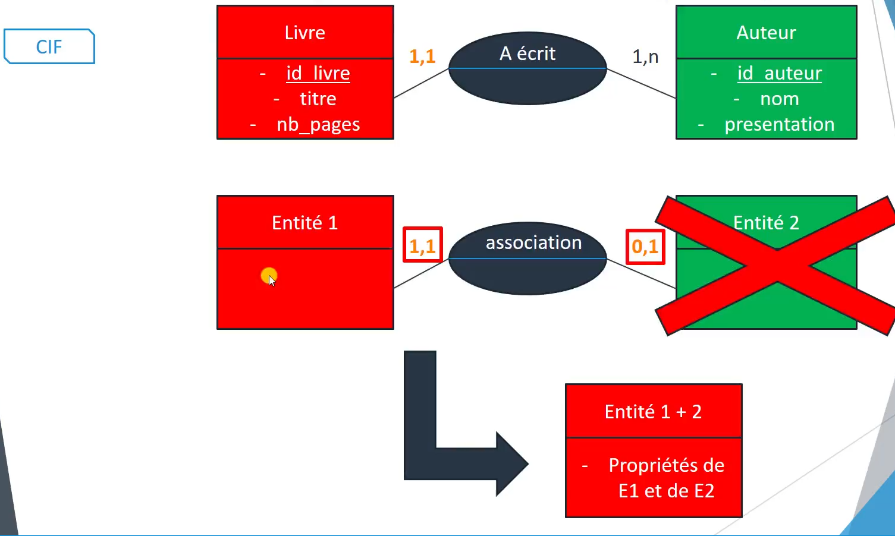
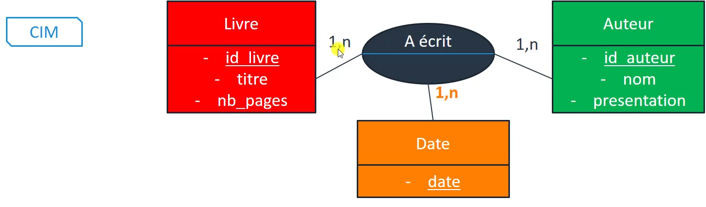
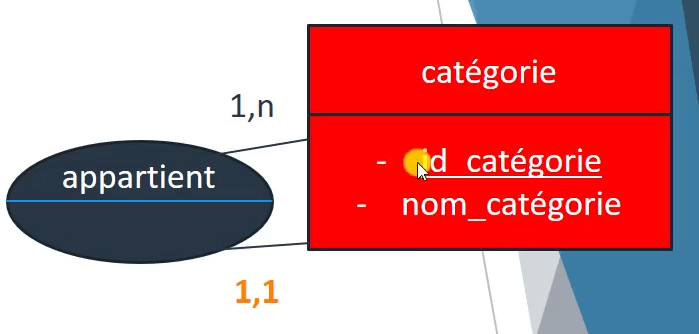
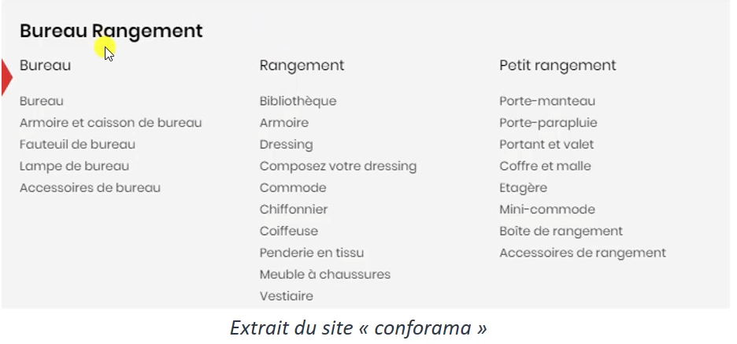

# 
 CHAPITRE V : L'analyse des données

Comprenez-vous l'angoisse qui survenait maintenant quand, tout nouveau dans le développement, on vous disait innocemment de faire un MCD et que vous étiez prêt ? Et que vous aviez pourtant cette sensation d'être perdu ?

Charger comme un sanglier n'aide pas à régler le problème (dans le développement c'est vrai en tout cas...). Parler pendant des heures pour répéter "mais je n'ai toujours pas compris" signifie que vous avez négligé les étapes précédentes. Il n'y a pas de pire possibilité pour une équipe que de ne pas savoir ou elle va. La prochaine fois calmez-vous, isolez vous de l'équipe et revoyez vos perspectives si vous n'êtes ni prêt à les formuler ni prêt à les entendre. 

> 
"Votre calme n'est pas un simple atout, c'est une nécessité."

Vous avez remanié votre jugement sur la chose ? Si vous commencez votre projet par cette étape, c'est que vous avez manqué... 4 étapes ! Voyons enfin le MCD en espérant que vous avez pris conscience de votre manque de rigueur en croyant que le MCD allait être suffisant.

___

## 
 PARTIE I : Introduction à l'analyse des données

Étape cruciale pour pouvoir créer une BDD qui rappellerons le, est un outil externe au programme et qui permet de stocker et de manipuler des données facilement de manière structurelle.

Nous allons délaisser quelques instants pour revenir sur l'étude de cas précédente et nous concentrer sur une gestion de bibliothèque basique et plus facile à comprendre et nous reviendrons à notre gestionnaire de paie plus tard. (enfin peut être, soyez patient je n'aurais pas forcément publié ce didactitiel avec les documents tout de suite)

Un logiciel informatique comporte toujours deux parties : 
- les données ( information vitale )
- les traitements ( action qui manipule les données ).

## 
 Utilité concrète du MCD 

Le but du MCD est :
- de structurer les informations de manière intelligente
- éviter les redondances d'information

Un exemple de redondance sur une liste de livre :

| TITRE  | NOMBRE DE PAGE  | NOM AUTEUR |PRENOM AUTEUR |AGE AUTEUR |
| :--------------- |:---------------:| -----:|-----:|-----:|
| livre 1 |   200   |PROUST |Marcel |32 |
| livre 2 | 150  |  PROUST |Marcel | 32|
| livre 3 | 355     |    DURIF |Sylvain |25|
| livre 4 |   225   |  DURIF |Sylvain |❌32|
| livre 5 | 123    |   DURIF |Sylvain | 25|
|livre 6 | 456    |   LAPLACE |Simon |18 |

On remarque ici :
- chaucune des informations concernant l'auteur est répété plusieurs fois sur les livres disposant du même auteur.
    - c'est une redondance.
    - nous n'avons pas besoin que cette information se répète.
    - une erreur s'est glissé dans l'âge.

Nous aurions pu mettre le numéro de l'auteur sur chaque ligne ce qui évitee les erreur et simplifie notre tableau que nous allons diviser en deux :

tableau des livres :

| TITRE  | NOMBRE DE PAGE  |NUMERO AUTEUR |
| :--------------- |:---------------:| -----:|
| livre 1 |   200   |1 |
| livre 2 | 150  |  1 |
| livre 3 | 355     |    2 |
| livre 4 |   225   |  2 |
| livre 5 | 123    |   2 |
|livre 6 | 456    |   3 |

tableau des auteurs :

| AUTEUR  | NOM  |PRENOM |AGE |
| :--------------- |:---------------:| -----:|-----:|
| 1 |   PROUST   |Marcel |32 
|  2 | DURIF  |  Sylvain |25
|  3 | LAPLACE     |    Simon |18

Le fait d'avoir fait un tableau uniquement sur l'auteur permet de le rassembler sous un même élément (ici un nombre) et d'utiliser se nombre dans le tableau des livres pour l'épurer et éviter les erreurs.

cette liaison que nous avons identifié et créé est le principal travail du MCD.

## 
 PARTIE II : MCD - la Contrainte d’Intégrité Fonctionnelle (CIF)

Nous allons voir comment représenter les informations dans un MCD et nous allons alors regrouper les informations en entité. 

Une entité est un regroupement d'informations permettant de définir un objet ou un individu au sein du sysstème d'information. 

cette entité dispose d'attributs (aussi appelés propriétés) correspondant à la liste des informations permettant de définir un objet ou un individu.

une entité dispose d'un identifiant (en général un numéro) qui permet de l'identifier de manière unique. (par exemple le numéro de sécurité sociale pour une personne )

exemple :

| id_livre  | titre  |nb_page |auteur |
| :--------------- |:---------------:| -----:|-----:|
| 1 |   hagakure   |150 |yamamoto tsunemoto
|  2 | L'Esprit indomptable   |  200 | Maître Takuan
|  3 | Le Zen des samouraïs    |    300 | Maître Takuan
|  4 | l'art de la guerre     |    300 | sun zu

et voici à quoi reseemble une entité :

| LIVRE  | 
| :--------------- 
| -id_livre | 
|  -titre|
|  -nb_page | 
|  -auteur | 

- le nom de l'entité : LIVRE
- l'identifiant : id_livre (toujours placé en haut)
- les propriétés: id_livre, titre, nb_page, auteur.

Imaginons que nous souhaitions apporter une description de l'auteur dans un nouveau tableau :

| id_livre  | titre  |nb_page |auteur |présentation auteur |
| :--------------- |:---------------:| -----:|-----:|-----:|
| 1 |   hagakure   |150 |
yamamoto tsunemoto|samurai du XVII eme siècle reconnu pour ses exploits et ses anecdotes

|  2 | L'Esprit indomptable   |  200 | Maître Takuan| 
maitre bouddhiste du XVI eme siècle reconnus pour avoir formé plusieurs daimyo et même un empereur du japon
 
|  3 | Le Zen des samouraïs    |    300 |Maître Takuan|
maitre bouddhiste du XVI eme siècle reconnus pour avoir formé plusieurs daimyo et même un empereur du japon 
|  4 | l'art de la guerre     |    300 | sun zu| 
Stratège vivant à -500 ans av JC connus pour son livre exeptionelle, mais souvent incompris et détourné par des marketeux idiots.

notre entité ressemblerai alors à :

| LIVRE  | 
| :--------------- 
| -id_livre | 
|  -titre|
|  -nb_page | 
|  -auteur | 
|  -presentation_auteur |

Mais nous remarquons très vite que la redondance est ici pénible et que pire encore : les descriptions contiennent plusieurs éléments qui diffèrent, ce qui augmente le nombre d'erreurs et de lourdeur dans notre BDD. 

Il sera alors plus intéréssant de scinder le problème en deux tableaux :

| id_livre  | titre  |nb_page |
| :--------------- |:---------------:| -----:|
| 1 |   hagakure   |150 |
|  2 | L'Esprit indomptable   |  200 |
|  3 | Le Zen des samouraïs    |    300 |
|  4 | l'art de la guerre     |    300 |

et un tableau sur les infos de l'auteur :

| id_auteur  | nom  |presentation |
| :--------------- |:---------------:| -----:|
| 1 |   yamamoto tsunemoto   |
samurai du XVII eme siècle reconnu pour ses exploits et ses anecdotes |
|  2 | Maître Takuan  |  
maitre bouddhiste du XVI eme siècle reconnus pour avoir formé plusieurs daimyo et même un empereur du japon  |
|  3 | sun zu   |    
Stratège vivant à -500 ans av JC connus pour son livre exeptionelle, mais souvent incompris et détourné par des marketeux idiots. |

et nos deux entités :

| LIVRE  | 
| :--------------- 
| -id_livre | 
|  -titre|
|  -nb_page |  

| auteur  | 
| :--------------- 
| -id_auteur| 
|  -nom|
|  -presentation | 

Le problème pour le moment est que nous n'avons aucune liaison entre les livres et les auteurs. Nous allons créer cette liaison et voir ce qu'est une association :  

l'association est représenté par une bulle contenant un nom. il faut alors rajouter deux combinaison de chiffre appelé les cardinalités. ces cardinalités permettent d'indiquer comment se fait la liaison entre les entités.

Les cardinalités vont répondre à deux questions :
1. Combien livre peut être écrit par un auteur ?
    - ici notre livre peut être créé au minimum par un auteur 
    - au maximum par un auteur (pas de notion de co-auteur dans cette exemple)
2. Combien d'auteurs peuvent écrire un livre ?
    - Un auteur pourra n'avoir écrit aucun livre (un premier livre pas encoree publié car l'outil peut représenter un auteur dans cette situation)
    - un auteur pourra avoir écrit plusieurs livre (représenté par n)
        - On peut remplacer n par un nombre si on est sûr que le maximum est du nombre que nous aurions alors mis. (c'est assez rare et n est souvent ce qui est mis)

L'association que nous venons de mettre en place est une association de type **CIF (contrainte d’Intégrité Fonctionnelle)**. Celle-ci correspond à des cardinalités mises en évidence, c'est-à-dire des cardinalité 1,1 ou 0,1 d'un coté et d'une cardinalité de l'autre côté de 0,n ou 1,n. 

Ce qui est important de savoir, c'est que si nous avion des cardinalité par exemple à gauche de 1,1 et à droite de 0,1 alors ça ne sert à rien d'avoir une association. On interprétera ça alors que l'on peut regrouper les deux entités en une seule.

si nous réajustons nos tableau cela donnera alors pour le tableau du livre :

| id_livre  | titre  |nb_page |id_auteur |
| :--------------- |:---------------:| -----:|-----:|
| 1 |   hagakure   |150 |1 |
|  2 | L'Esprit indomptable   |  200 | 2 |
|  3 | Le Zen des samouraïs    |    300 | 1 |
|  4 | l'art de la guerre     |    300 | 3 |

pour l'auteur ça ne bouge pas :

| id_auteur  | nom  |presentation |
| :--------------- |:---------------:| -----:|
| 1 |   yamamoto tsunemoto   |
samurai du XVII eme siècle reconnu pour ses exploits et ses anecdotes |
|  2 | Maître Takuan  |  
maitre bouddhiste du XVI eme siècle reconnus pour avoir formé plusieurs daimyo et même un empereur du japon  |
|  3 | sun zu   |    
Stratège vivant à -500 ans av JC connus pour son livre exeptionelle, mais souvent incompris et détourné par des marketeux idiots. |

C'est bien l'information de l'id de l'auteur pour 1 auteur donné qui sera intégré dans la partie livre puisque c'eest bien un livre donné qui aura dans tout le cas 1 auteur. Je ne peux pas donner un livre donné dans la table de l'auteur, car il en aura plusieurs : il faudrait mettre une liste de livres.

Il est essentiel de comprendre pourquoi c'est l'auteur qui va dans le tableau du livre, car c'est exactement ce qui va se passer dans la BDD. Soyez plus que vigilant, car quand vous regardez dans l'entité livre, on n'y mentionne pas l'id de l'auteur: c'est l'association qui le schématise.

___

## 
 PARTIE III : MCD - la Contrainte d’Intégrité Multiple (CIM)

Regardons le cas où un livre peut être écrit par de multiples auteurs et où un auteur peut écrire évidemment plusieurs livres. (cardinalités 1,n - 1,n)

Reprenons nos tableaux en y ajoutant un cinquième livre qui serait écrit par les trois auteurs dont nous disposons (le livre 4) :

les livres :
| id_livre  | titre  |nb_page |
| :--------------- |:---------------:| -----:|
| 1 |   hagakure   |150 |
|  2 | L'Esprit indomptable   |  200 |
|  3 | Le Zen des samouraïs    |    300 |
|  4 | l'art de la guerre     |    300 |
|  5 | le livre ultime de la guerre     |    450 |

les auteurs :

| id_auteur  | nom  |presentation |
| :--------------- |:---------------:| -----:|
| 1 |   yamamoto tsunemoto   |
samurai du XVII eme siècle reconnu pour ses exploits et ses anecdotes |
|  2 | Maître Takuan  |  
maitre bouddhiste du XVI eme siècle reconnus pour avoir formé plusieurs daimyo et même un empereur du japon  |
|  3 | sun zu   |    
Stratège vivant à -500 ans av JC connus pour son livre exeptionelle, mais souvent incompris et détourné par des marketeux idiots. |

dans le cas d'une CIM, on utilise un troisième tableau pour faire le lien entre les deux tableaux :

| id_livre  | id_auteur  |
| :--------------- |:---------------:| 
| 1 |   1 |
|  2 | 2 | 
|  3 | 2  |    
|  3 | 3  | 
|  4 | 1  | 
|  4 | 2  | 
|  4 | 3  | 

En ajoutant plusieurs fois l'id du livre avec plusieurs auteurs, je peux ajouter à chaque fois l'id d'un auteur qui a contribué au livre.

Si le tableau est bien effectué, il sera impossible d'avoir 2 fois la même combinaison. Si une combinaison se répète la BDD affichera une bonne grosse erreur. 

Les cardinalités sont fondamentales, car ces notions de CIF et de CIM peuvent tout changer, pour le meilleur comme pour le pire si on en a une mauvaise compréhension.

Il est possible d'avoir également des propriétés comme pour les entités. Dans l'exemple, ci-joint, on peut rajouter l'information de la durée durant laquelle un auteur a travaillé sur un livre par exemple et ce n'est possible que dans les CIM.

### 
 les ternaires dans les CIM

Nous pouvons réaliser des ternaires avec les CIM, c'est-à-dire avoir "3 pattes" à une association. Ne vous laissez pas séduire par ce joli nom, car une ternaire pourrait avoir plus de pattes que 3. Chacune de ces pattes devrons alors avoir en cardinalité 1, n :

et nous donnera ce joli tableau :

| id_livre  | id_auteur  |date  |
| :--------------- |:---------------:| :---------------:| 
| 1 |   1 | 10/10/2010 |
| 1 |   1 | 11/10/2010 |
|  2 | 2 |  11/10/2010 |
|  3 | 2  | 10/10/2010 |
|  3 | 3  |  15/10/2010 |
|  4 | 1  |  10/10/2010|
|  4 | 2  |  15/10/2010 |
|  4 | 3  |  18/10/2010 |

Nous pouvons voir que les auteurs ont alors en effet :
- contribué sur un même livre
- sur des dates différentes que nous disposons
- qu'un auteur a pu contribuer sur le même livre a des dates différentes comme le démontrent les deux premières colonnes.

Ici encore votre tableau ne pourra contenir la même combinaison. Pour les plus Hardores d'entre vous, on peut prédire des combinaisons en remplaçant le n par un nombre précis et ensuite envisager un nombre de combinaisons possible : c'est le monde des  [combinatoires](https://www.wikiwand.com/fr/Combinatoire#:~:text=En%20math%C3%A9matiques%2C%20la%20combinatoire%2C%20appel%C3%A9e,ensembles%20finis%2C%20et%20les%20d%C3%A9nombrements.) issu des [mathématiques discrètes](https://www.wikiwand.com/fr/Math%C3%A9matiques_discr%C3%A8tes).

> 
je m'exsuse pour cette petite digression.

## 
 PARTIE IV: MCD - la réflexivité (CIM)

Je vous présente le dernier point que je présenterai personnellement sur le MCD, la réflexivité.

Nous allons prendre l'exemple très parlant d'un site comme conforama pour illustrer cette notion. Le nombre de produits en vente est souvent énorme et les utilisateurs vont pouvoir faire leurs recherches en fonction de catégorie et pourront aller de lanière très précise dans une catégorie présente dans une autre catégorie.

Nous avons donc un système de catégorie et de sous-catégorie à l'intérieur.

C'est la réflexivité qui va nous permettre de modéliser cela en faisant en sorte qu'une entité puisse être lié à elle-même au travers d'une "association réflexive".

Ici notre entité est bien relié à elle même, c'est l'association réflexive. ici nous disons qu'une catégorie pourra faire partie d'une autre catégorie. 

ici nous avons trois catégories principales. 

et voici le tableau correspondant :

| id_livre  | nom_catégorie  |id_catégorie_parente |
| :--------------- |:---------------:| :---------------:| 
| 1 |   bureau |  |
| 2 |   rangement |  |
|  3 | petit rangement |  |
|  4 | bureau  | 1 |
|  5 | armoire en caisson  |  1 |
|  6 | fauteuil de bureau  |  1|
|  7 | bibliothèque  |  2 |
|  8 | armoire  |  2|
|  9 | porte-manteau | 3 |

Le tableau est incomplet (par fainéantise), mais observez le : nous déclarons nos 3 catégories principales avec id_catégorie_parente vide. Ensuite, nous mettons nos sous-éléments en indiquant l'id_catégorie correspondante dans id_catégorie_parente.

de la même manière que pour les entités et les associations non réflexive, il sera possible dans le cas de la réflexivité de faire des associations CIM. cela impliquera qu'une sous catégorie peut appartenir à plusieurs catégories parente:

on reprend le tableau en enlevant la colone id_catégorie_parente : 

| id_livre  | nom_catégorie  |
| :--------------- |:---------------:| 
| 1 |   bureau |  
| 2 |   rangement |  
|  3 | petit rangement | 
|  4 | bureau  | 
|  5 | armoire en caisson  |  
|  6 | fauteuil de bureau  |  
|  7 | bibliothèque  |  
|  8 | armoire  |  
|  9 | porte-manteau | 

Et on recrée un tableau du même type que vue précédemment avec les critères d'une CIM : 

| id_catégorie  | id_catégorie_parente  |
| :--------------- |:---------------:| 
| 4 |   1 |
|  5 | 1 | 
|  7 | 1  |    
|  7 | 2  | 
|  7 | 3  | 
|  8 | 2  | 
|  8 | 3  | 

Ici, il faudra comprendre que notre armoire fait partie da la catégorie rangement et petit rangement (ben, si c'est une toute petite armoire après tout...) et qu'en est il de la bibliothèque selon vous ? Tout juste ! c'est une sous-catégorie présente dans les 3 catégories.

___

Fin du chapitre concernant le MCD. Merci d'avoir lu ce didacticiel. Prochain chapitre :

 **"le dictionnaire des données"**
