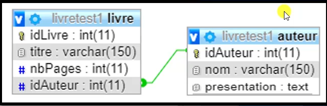
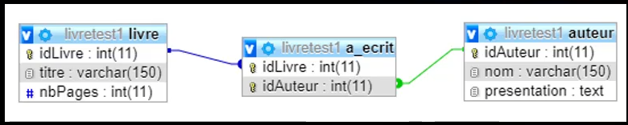

# 
 CHAPITRE VII : le Modèle logique de données (MLD) et le modèle physique des données (MPD)

## 
 PARTIE I : Introduction au modèle logique de données

Nous allons voir comment obtenir notre modèle logique de données (MLD) à partir de notre MCD. C'est une vision qui sera plus proche de la BDD et va ajuster quelques éléments de la vision conceptuelle. Souvent boudée sur les petits projets, elle a pourtant pour vertu de clarifier davantage notre perception de la conception : un néophyte ne devrait pas sauter cette étape.

La partie conceptuelle fait partie du coeur de la conception de la BDD . pou transformer notre MCD en MLD, il suffit de respecter quelques règles assez simple :
- une entité devient une table
- les identifiants deviennent des clefs primaires
- les associations CIF (cardinalité 0,1 ou 1,1) deviennent des clefs étrangères
- les associations CIM (cardinalité 0,n ou 1,n des deux cotés d'une association) deviennent des tables, dont la clef primaire est la combinaison des clefs étrangères des tables qui les composent.

Rappellez vous de notre MCD sur les livres :

les livres :
| id_livre  | titre  |nb_page |
| :--------------- |:---------------:| -----:|
| 1 |   hagakure   |150 |
|  2 | L'Esprit indomptable   |  200 |
|  3 | Le Zen des samouraïs    |    300 |
|  4 | l'art de la guerre     |    300 |
|  5 | le livre ultime de la guerre     |    450 |

les auteurs :

| id_auteur  | nom  |presentation |
| :--------------- |:---------------:| -----:|
| 1 |   yamamoto tsunemoto   |
samurai du XVII eme siècle reconnu pour ses exploits et ses anecdotes |
|  2 | Maître Takuan  |  
maitre bouddhiste du XVI eme siècle reconnus pour avoir formé plusieurs daimyo et même un empereur du japon  |
|  3 | sun zu   |    
Stratège vivant à -500 ans av JC connus pour son livre exeptionelle, mais souvent incompris et détourné par des marketeux idiots. |

la CIM (représenté plus bas par "A_ecrit"): 

| id_livre  | id_auteur  |
| :--------------- |:---------------:| 
| 1 |   1 |
|  2 | 2 | 
|  3 | 2  |    
|  3 | 3  | 
|  4 | 1  | 
|  4 | 2  | 
|  4 | 3  | 

et voici désormais comment se présente notre MLD pour les livres :
- MLD CIF: 
    - Livre (~~id_livre~~, titre, nb_page, #id_auteur)
    - Auteur (~~id_auteur~~, nom, presentation)
- MLD CIM :
    - Livre (~~id_livre~~, titre, nb_pages)
    - Auteur (~~id_auteur~~, nom, presentation)
    - A_ecrit (~~#id_livre~~, ~~#id_auteur~~)

Vous remarquerez les éléments barrés. Normalement, ils sont soulignés et montrent que ce sont des clefs primaires.

analysons en détail pour être sur que nous soyons sur la même longuer d'onde et reprenons la première ligne du MLD et détaillons la :

`- Livre (~~id_livre~~, titre, nb_page, #id_auteur)`

- `livre` est notre entité qui devient une table.
- `~~id_livre~~` est l'identifiant devient la clef primaire et devient le premier champ.
- `#id_auteur` est une clef étrangère et est représenté par le # devant.

Vous avez remarqué la présence du MLD CIF et du MLC CIM. Dans celui du CIM la clefs étrangère n'est plus présente ce qui est normal car nous avons dès lors des cardinalités 1,n -1,n. La table détient l'id_livre et l'id_auteu. Ses deux informations permettent de réaliser la clef primaire de la table A_ecrit, ce qui confirme encore qu'une combinaison ne pourra pas se répéter dans cette table.

J'insiste encore que c'est **la combinaison des deux clefs étrangères qui la compose qui est la clef primaire.** et la # montre bien que ce sont des clefs étrangères. Pour les ternaires  il suffirait de rajouter la clefs étrangère supplémentaire dans la table A_ecrit :

` - A_ecrit (~~#id_livre~~, ~~#id_auteur~~, ~~#date~~)`

Nous avons fini notre MLD et somme alors presque capable de créer notre BDD, en effet pour cela, nous allons devoir regarder le schéma suivant, le modèle physique de données (MPD).  

## 
 PARTIE II : Introduction au modèle physique de données

Le MPD est le représentation schématique de la BDD réelle. Ce diagramme montre, en plus des liens entres les tables, les différents types de données. Il est la synthèse du MCD, MLD et du dictionnaire de données.

Ce modèle est parfois générable automatiquement d'une base de donnée comme dans PHPMyAdmin.

le MPD de la CIF :

Le MPD de la CIM :

La différence concrète entre le MCD et le MPD et donc la présence des types et les clefs étrangère dans le MPD. C'est donc une étape qui peut avoir son importance surtout pour les néophytes encore.

___

Fin du chapitre concernant le MLD et le MPD. Merci d'avoir lu ce didacticiel. Prochain chapitre :

 **"l'analyse des traitements "**

